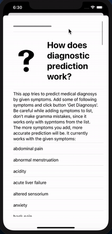
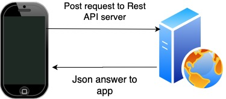

# Predicting_Diseases_App
This is a simple diseases prediction app. It applied machine learning (decision tree classifier) to predict medical diagnosis from given symptoms

How to use:

1) Start server:
	- python /your path to server/server.py
	- start app in Xcode 
	- write symptoms from list in section "How it works?"
	- click "Get diagnosys"

Things to improve:
1) It works only with batch of symptoms that hardcoded in app. That symptoms extracted from the data. Hence, if user sends symptom not from the given list - app won't work
2) Apply fully NLP. With this approach user could write a big sentences describing his symptoms and model can exctract diagnos from this.
